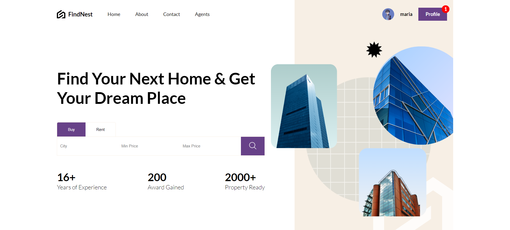
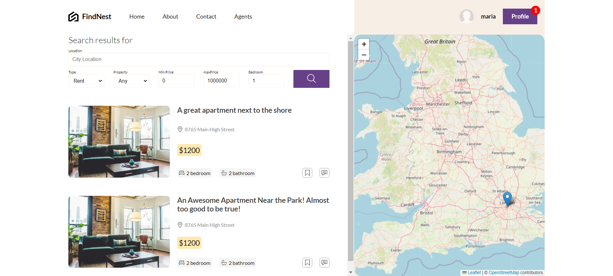
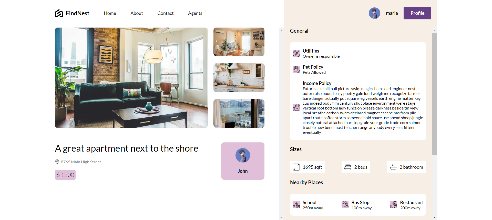
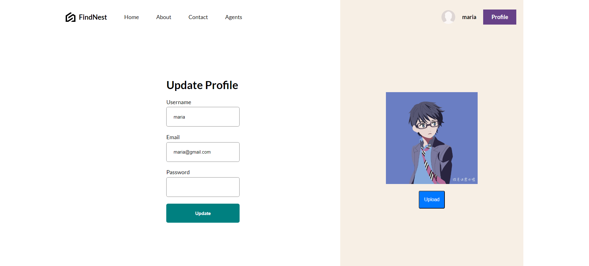
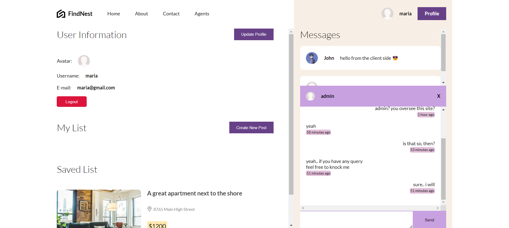

# FindNest

**FindNest** is a full-stack web application designed as an apartment rent and buy marketplace. The platform allows users to search for apartments, communicate with property owners via real-time chat, and explore properties through integrated maps.

## Features

-   **Real-time Chat**: Users can communicate instantly with property owners or potential tenants.
-   **Map Integration**: Visualize property locations on an interactive map.
-   **Apartment Search**: Filter and search for apartments to rent or buy based on various criteria.
-   **Responsive Design**: Optimized for both desktop and mobile devices.

## Tech Stack

-   **Frontend**:
    -   **React**: A JavaScript library for building user interfaces.
    -   **Zustand**: A state management library for React.
-   **Backend**:
    -   **Node.js**: A JavaScript runtime built on Chrome's V8 engine.
    -   **Express.js**: A minimal and flexible Node.js web application framework.
    -   **Prisma ORM**: An open-source database toolkit that simplifies working with databases.
    -   **SocketIO**: An event driven library for real-time web applications.
-   **Database**:
    -   **MongoDB**: A NoSQL database for storing user data, property listings, and chat messages.

## Screenshots
**Homepage**

**Housing Listing with Search Functionality**
  

**Housing Listing with Search Functionality**

**Profile Update**

**Profile Page and Real-time chat with seller**

**Housing Image Slider**

